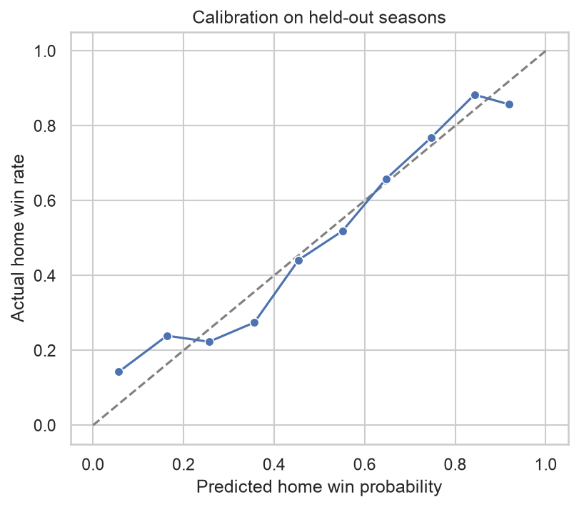
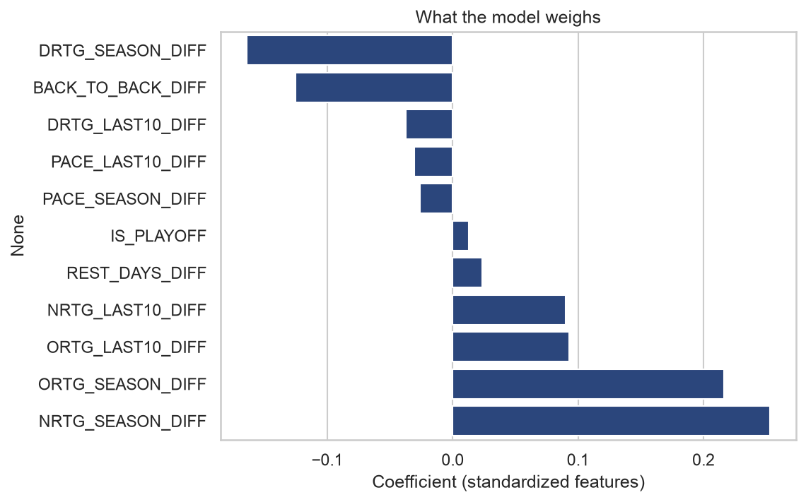
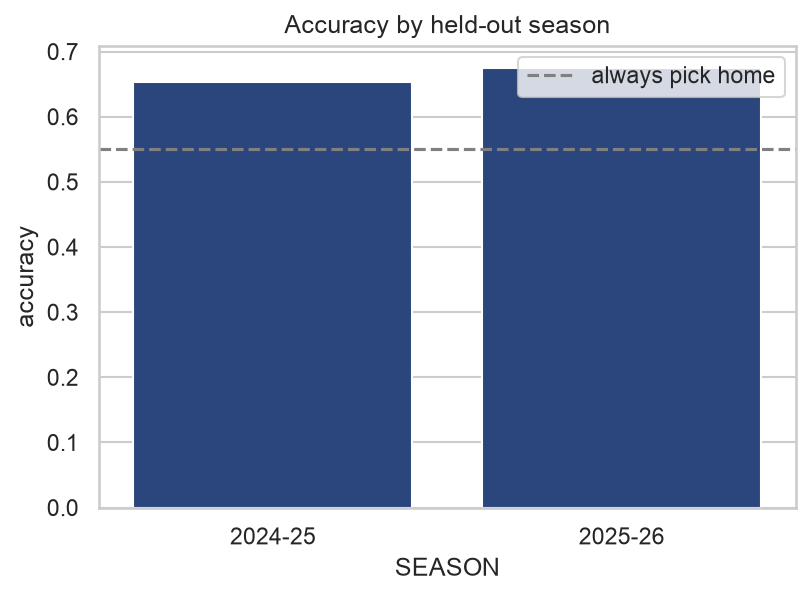

# NBA Game Predictor

Predicts the winner of upcoming NBA games and shows the reasoning at
a public URL. A logistic regression trained on the last 10 seasons of
team stats: offensive and defensive rating, pace, recent form, and rest.

## How it works

1. A daily scheduled job (`scripts/daily_refresh.sh`, run locally since
   stats.nba.com blocks cloud datacenter IPs) pulls team game logs with
   `nba_api` and pushes the refreshed predictions, which triggers the
   Pages deploy. Schedule data comes from the ScoreboardV3 endpoint (its
   predecessor was deprecated upstream and stopped returning valid JSON).
2. `pipeline/features.py` builds pre-game features for every matchup.
   Every number a prediction uses comes strictly from games played
   before tip-off.
3. A scikit-learn logistic regression outputs a home win probability.
   Its coefficient contributions become the plain-language explanation
   on each card.
4. The static site deploys to GitHub Pages. No server.

## Model honesty

Evaluated on the two most recent seasons (2,587 games the model never
saw during training): 66.4% accuracy against a 55.1% always-pick-home
baseline, log loss 0.611. Vegas favorites win about 67% of games, so a
stats-only model at this level is performing right at its ceiling.





## Run it locally

```bash
python3 -m venv .venv && source .venv/bin/activate
pip install -r requirements.txt
python -m pipeline.fetch      # ~2 minutes first time, caches to data/
python -m pipeline.train      # prints held-out metrics, saves the model
python -m pipeline.predict    # writes site/predictions.json
python3 -m http.server 8321 -d site
```

## Tests

```bash
pytest
```
